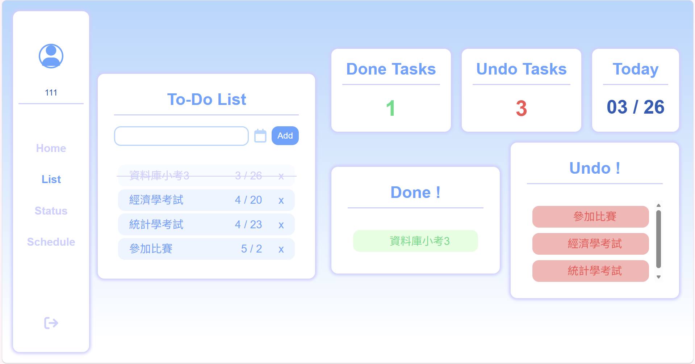

# 📝 To Do List

一個結合「任務管理 × 數據視覺化 × 行事曆整合」的 To-Do List 應用，
幫助使用者不只記錄任務，更能分析時間使用與完成效率。




## 核心功能

### 使用者系統
- 使用者註冊 / 登入
- Navbar 依登入狀態動態切換
- 個人化任務管理

### 任務管理
- 新增、刪除 To-Do
- 標記完成 / 未完成

### 數據分析
- 任務完成 / 未完成數量統計
- 完成率 / 未完成率分析
- 使用圖表視覺化任務狀態

### 任務視覺化
- **甘特圖（Gantt Chart）**
  - 呈現任務時間分布
  - 協助規劃任務進度
- **行事曆（Calendar View）**
  - 顯示每日任務
  - 以顏色區分完成狀態


## 技術架構

### Frontend
- Vue 3
- Vue Router
- Chart.js

### Backend
- Flask
- SQLAlchemy

### Dev Tools
- concurrently（同時啟動前後端）


## 安裝與執行

### 1. Clone 專案
```bash
git clone https://github.com/Clare0808/to-do-list.git
cd to-do-list
```

### 2. 安裝套件

```bash
npm install
```

### 3. 環境需求

- Node.js
- npm
- Python
- SQLAlchemy

### 5. 啟動專案

```bash
npm run dev
```

若要分開啟動 (選擇性) :

#### 前端

```bash
npm run serve
```

#### 後端
```bash
cd backend
python app.py
```
